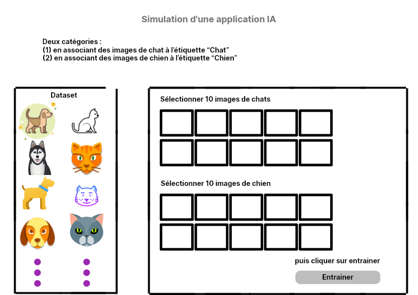
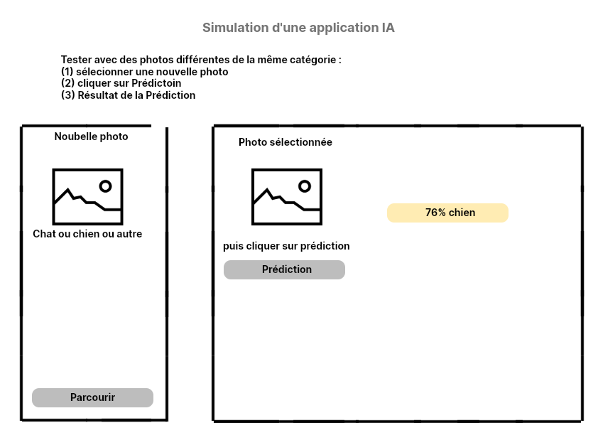

# 🐱🐶 Mini-Projet : Classification d'Images (Chats & Chiens) 🖼️

## 📌 **Description**
Ce projet est une application de Machine Learning qui permet de classer des images entre **chats** et **chiens**. L'interface est développée en **Tkinter**, et la classification est réalisée avec un modèle pré-entraîné **MobileNetV2** via **TensorFlow**.

---

## 🚀 **Fonctionnalités**
✅ **Création d'un dataset** : Importation d'images de chats et de chiens 📂
✅ **Entraînement du modèle** : Utilisation de MobileNetV2 🧠
✅ **Test d'une image** : Prédiction et affichage du pourcentage de confiance 📊
✅ **Interface utilisateur intuitive** : Conçue avec Tkinter 🎨

---

## 🖼️ **Aperçu de l'interface**
### **Page 1 : Interface d’Entraînement**


### **Page 2 : Interface de Prédiction**


---

## 🛠️ **Technologies utilisées**
🔹 **Python** 🐍
🔹 **Tkinter** (Interface graphique) 🖥️
🔹 **TensorFlow** (Modèle MobileNetV2) 🔬
🔹 **OpenCV / PIL** (Traitement d'images) 🖼️

---

## 📦 **Installation**
Clonez le dépôt et installez les dépendances :
```bash
# Cloner le projet
git clone https://github.com/votre-repo/ml-chat-chien.git
cd ml-chat-chien

# Installer les dépendances
pip install -r requirements.txt
```

---

## 🎯 **Utilisation**
### 📥 **1. Lancer l'application**
```bash
python app.py
```

### 📤 **2. Charger une image et obtenir une prédiction**
- Cliquez sur **« Charger une image »** 📂
- Cliquez sur **« Prédire »** 🤖
- Obtenez le résultat : **Chat (95%)** ou **Chien (88%)** 🏆

---

## 🛠 **Améliorations futures**
🔹 Ajout d'une option d'entraînement personnalisé 🎯
🔹 Intégration d'une base de données d'images 📚
🔹 Interface plus moderne avec Tkinter avancé 🎨

---

## 🤝 **Contributions**
Les contributions sont les bienvenues ! Merci de suivre les étapes suivantes :
1. **Forkez** le repo 🍴
2. **Créez une branche** (`feature-amélioration`) 🌱
3. **Commitez vos modifications** (`git commit -m 'Ajout d'une nouvelle fonctionnalité'`) 💡
4. **Poussez la branche** (`git push origin feature-amélioration`) 🚀
5. **Ouvrez une Pull Request** 🔥

---

## 📜 **Licence**
Ce projet est sous licence **MIT** 📄

---

💡 _Créé avec ❤️ par [Mohammed Azan]_
